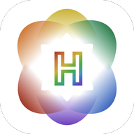

# Harmony


## Install
Clone the project :
```sh
git clone -b app --single-branch https://gitlab.com/harmonyp/harmony.git <FolderName>
```
Install all the dependencies :
```sh
npm i
```
Install modules (iOS only) :
```sh
cd ios
pod install
```

## Upgrade (Mike Cod only)
```sh
./import-dependencies.sh
```

## Compile Android App Bundle (Mike Cod only)
```sh
./build.sh
```
It will generate an app bundle in `android/app/build/outputs/bundle/release`.

## Submit to App Store (Mike Cod only)
Choose **any iOS device**. Choose a *new build* (**General** section), choose a *provisioning profile* (**Signing & Capabilities** section), choose **Apple Ditribution: Dimitri Simon** for **Code Signing Identity** (**Build Settings** section). Restart XCode, then **Harmony App Store** should be available as **Provisioning Profile**.
To build the application : Product > Archive. Type the password and choose **Always allow**.
To get all the builds : Window > Organizer.
Then choose the build to upload.

### Answers for Export Compliance Information
| Question | Answer |
|---|---|
| Does your app use encryption? Select Yes even if your app only uses the standard encryption within Apple’s operating system. | Yes |
| Does your app qualify for any of the exemptions provided in Category 5, Part 2 of the U.S. Export Administration Regulations? | Yes |
| Does your app implement any encryption algorithms that are proprietary or not accepted as standards by international standard bodies (IEEE, IETF, ITU, etc.)? | No |
| Does your app implement any standard encryption algorithms instead of, or in addition to, using or accessing the encryption within Apple’s operating system? | No |